# 🚀 Leader：高性能视频总结（Web 版）

这是一个“音频直提 + ASR 加速 + LLM 分段 + 按需并行截图”的视频总结工具，提供 **FastAPI 后端** + **Vue3 前端** 的交互式 Web 界面，支持：

- 🎥 上传本地视频（直传 MinIO）或粘贴 URL 导入（yt-dlp）
- 📄 **(New)** AI 文件总结：支持上传文档（PDF/Word/PPT/TXT/MD）进行智能分析与总结
- 📊 **(New)** 数据统计：标签词云图，直观展示分析内容的关键词分布
- 🕰️ **(New)** 历史记录：自动记录最近查看的分析内容，支持快速回溯
- 🎨 **(New)** 全新 UI 风格：统一的新拟态（Neo-Brutalism）卡片设计，视觉体验更佳
- 🧩 **(New)** Bilibili 浏览器扩展：一键提取 B 站视频内容
- 📋 **(New)** 异步任务管理：支持后台任务队列与状态追踪
- 🧠 一键生成文稿笔记、思维导图、AI 对话
- 🌍 双语字幕翻译与双字幕展示
- 📚 课件截图与 OCR（支持 VL 模型远程 OCR 或本地 Tesseract）

## 🖼️ 产品截图

<p align="center">
  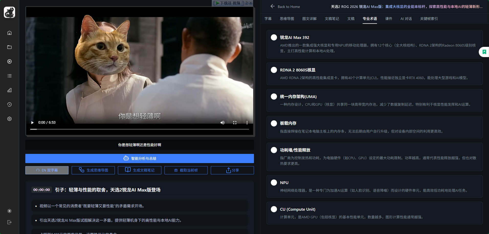
  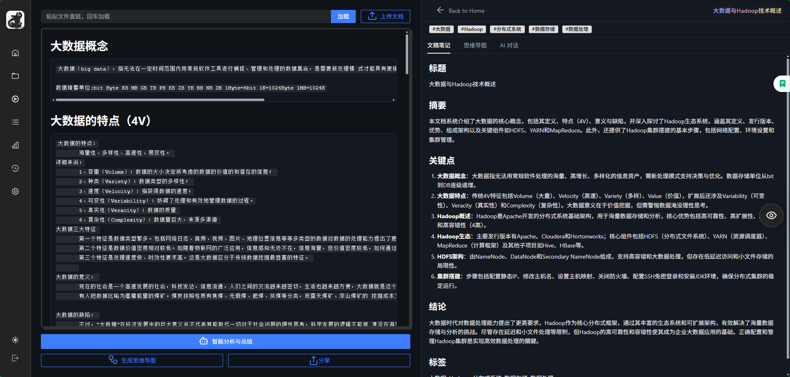
</p>
<p align="center">
  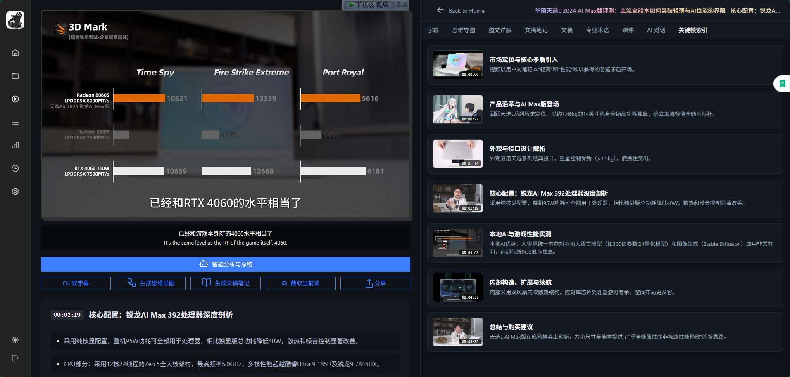
  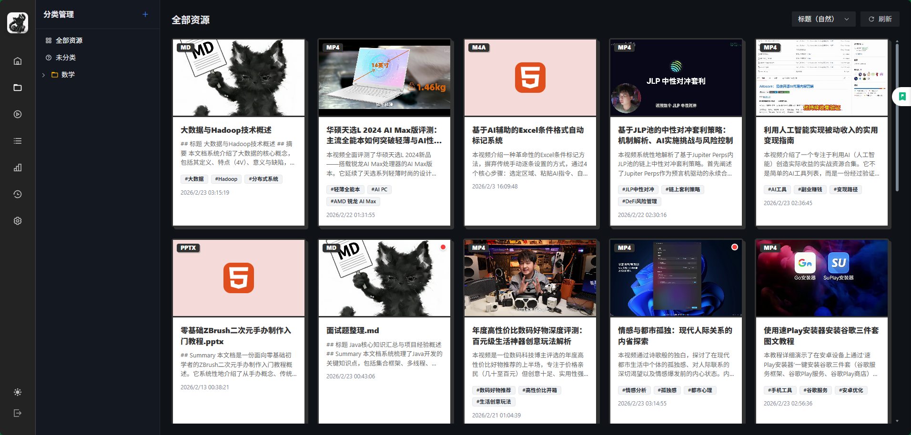
</p>
<p align="center">
  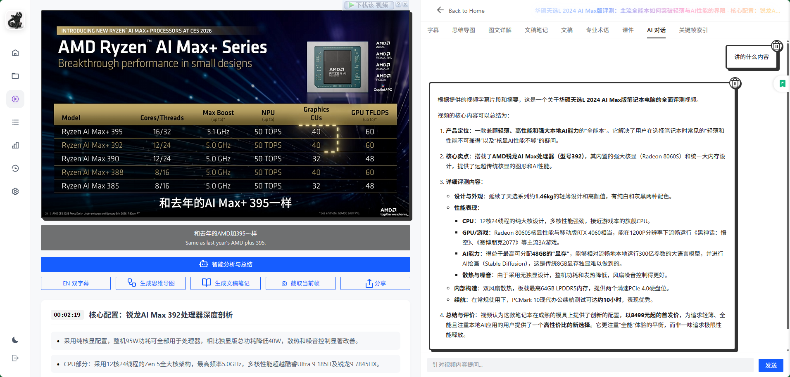
  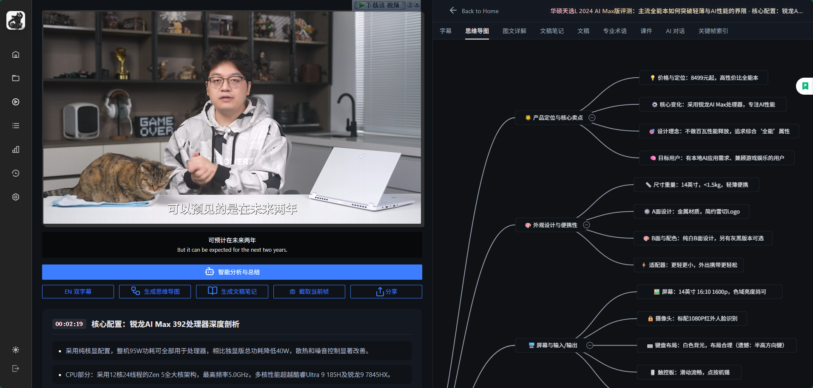
</p>
<p align="center">
  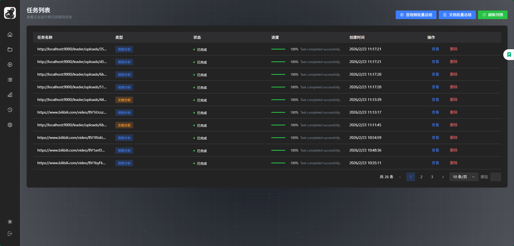
  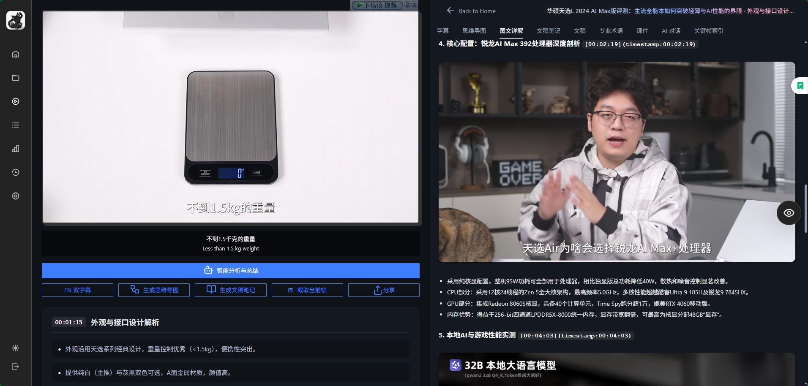
</p>
<p align="center">
  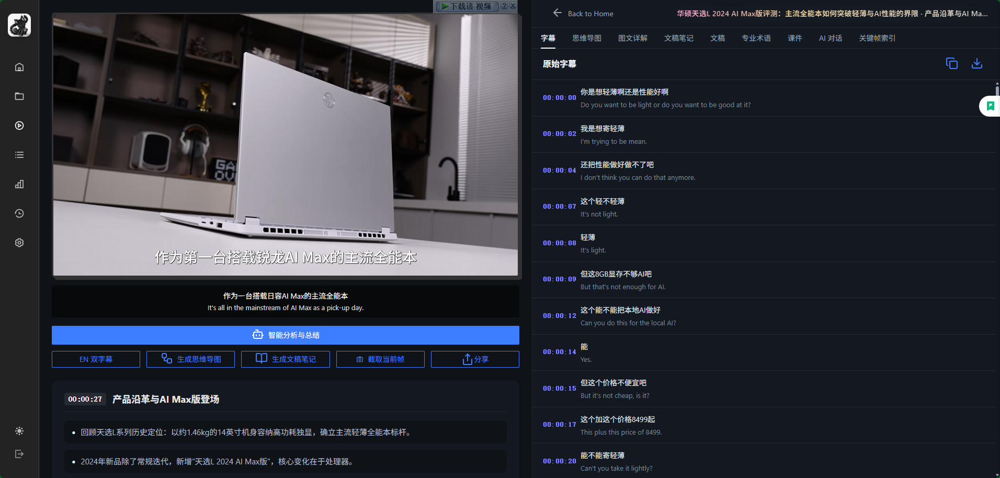
  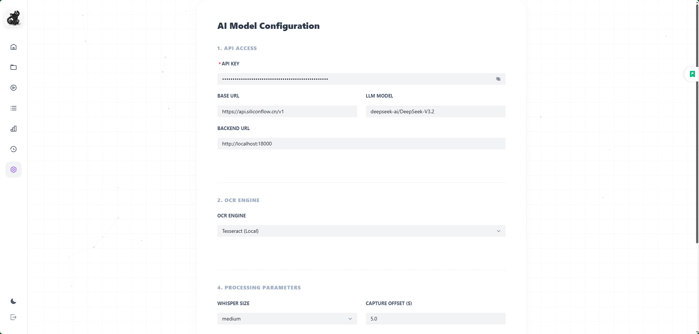
</p>
<p align="center">
  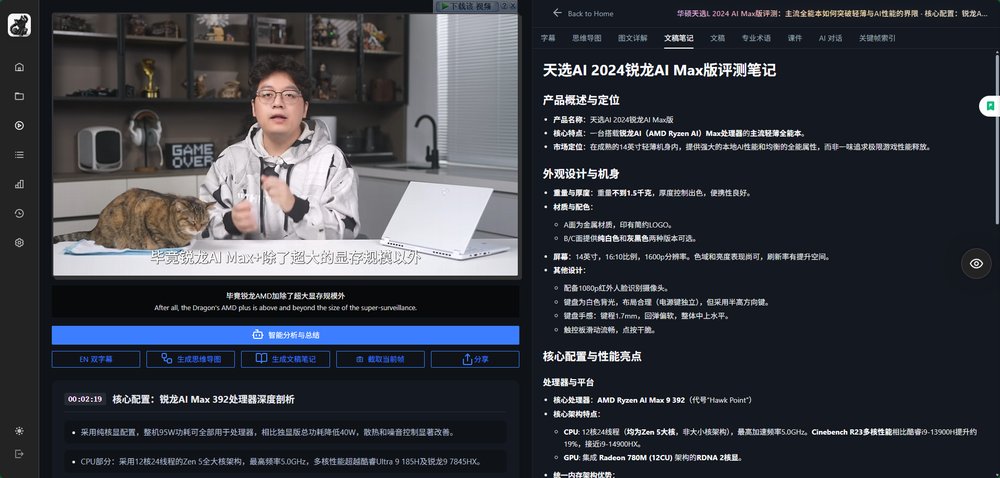
  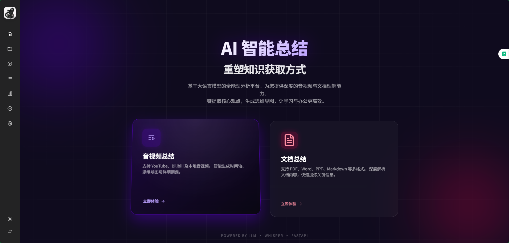
</p>
<p align="center">
  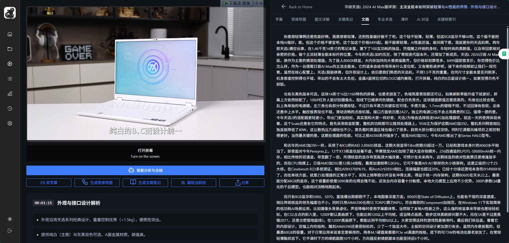
  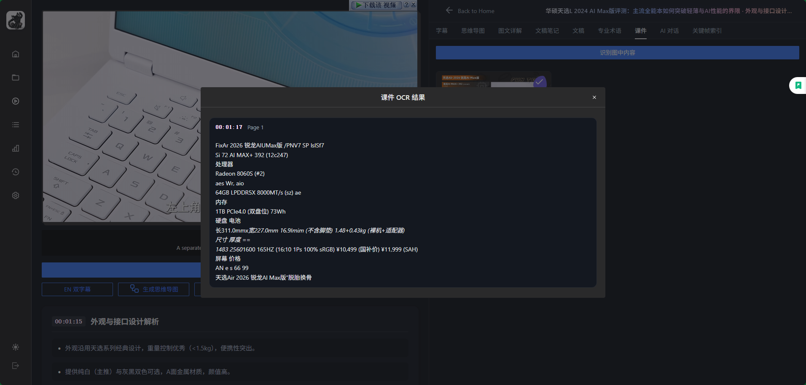
</p>

## 🏗️ 架构概览

- 后端入口：`main.py`（uvicorn 入口尽量保持精简）
- 后端实现：`leader_api/`（按职责拆分）
  - `leader_api/app.py`：应用创建与路由注册
  - `leader_api/minio_store.py`：MinIO 访问封装
  - `leader_api/mysql_store.py`：MySQL 数据库访问
  - `leader_api/task_store.py` & `task_worker.py`：异步任务管理与执行
  - `leader_api/minio_routes.py`：直传 MinIO 的 presign 接口
  - `leader_api/video.py`：URL 导入视频（yt-dlp）
  - `leader_api/analyze.py`：视频分析（流式输出进度）
  - `leader_api/file_routes.py`：文件处理与总结接口
  - `leader_api/tasks_routes.py`：任务管理接口
  - `leader_api/capture.py`：按时间点截图
  - `leader_api/ocr.py`：Tesseract/VL OCR
  - `leader_api/translate_routes.py`：字幕翻译
  - `leader_api/llm_routes.py`：聊天/思维导图/笔记
- 前端：`frontend-vue/`（Vite + Vue3 + Arco）
- 扩展：`bilibili-extension/`（Chrome 浏览器插件）

## 💾 存储策略（重要）

本项目默认 **MinIO Only**：

- 📹 视频文件：上传到 `uploads/<job_id>/...`
- 📊 分析产物：上传到 `outputs/<job_id>/...`（markdown + 图片等）
- 🧹 服务端分析时只使用临时目录写入中间产物，结束后统一上传到 MinIO，不依赖本地 `fast_output/`、`web_uploads/` 等持久目录

## 🛠️ 运行依赖

- 🐍 Python（建议 3.10+）
- 📦 Node.js（用于前端，建议 18+）
- 🎬 FFmpeg（用于音频抽取/视频处理）
- 🗄️ MinIO（必须，用于视频与产物存储）
- 🐬 MySQL（可选，用于任务持久化存储）
- 🐳 Docker & Docker Compose（可选，用于容器化部署）
- 👁️ 可选：Tesseract OCR（仅当选择 “Tesseract (Local)” 作为 OCR 引擎）

## ⚡ 快速开始（本地开发）

### 1) 📥 安装 Python 依赖

```bash
pip install -r requirements.txt
```

### 2) ⚙️ 配置 .env

复制 `.env.example` 为 `.env`，然后按需修改（不要把真实 key 提交到仓库）：

```bash
cp .env.example .env
```

常用环境变量（按需配置）：

```bash
# LLM / 供应商
OPENAI_API_KEY=你的Key
OPENAI_BASE_URL=https://api.siliconflow.cn/v1
LLM_MODEL=deepseek-ai/DeepSeek-V3

# MinIO（必填）
MINIO_ENDPOINT=127.0.0.1:9000
MINIO_ACCESS_KEY=minioadmin
MINIO_SECRET_KEY=minioadmin
MINIO_BUCKET=leader
MINIO_SECURE=false

# 可选：如果前端不是跑在同一台机器/容器里，或者浏览器访问 MinIO 的地址与后端不同
# 配它可以让生成的视频/图片 URL 更容易被浏览器直连访问
MINIO_PUBLIC_BASE_URL=http://127.0.0.1:9000

# 可选：yt-dlp 代理（YouTube 常用）
YTDLP_PROXY=http://127.0.0.1:7897
```

### 3) 🗄️ 启动 MinIO

二选一：

**方式 A：本地二进制**

```bash
.\minio.exe server E:\miniio --console-address ":9001"
```

**方式 B：Docker**

```bash
docker run -d --name leader-minio --restart unless-stopped ^
  -p 9000:9000 -p 9001:9001 ^
  -v E:\miniio:/data ^
  -e MINIO_ROOT_USER=minioadmin ^
  -e MINIO_ROOT_PASSWORD=minioadmin ^
  minio/minio server /data --console-address ":9001"
```

MinIO 控制台默认：`http://127.0.0.1:9001`

### 4) 🚀 启动后端（FastAPI）

```bash
python -m uvicorn main:app --host 0.0.0.0 --port 18000
```

### 5) 💻 启动前端（Vue3）

```bash
cd frontend-vue
npm install
npm run dev
```

打开前端后，在 Settings 中确认 `BACKEND URL`（默认 `http://localhost:18000`）。

## 📋 任务列表（批量总结）

前端「任务列表」支持一次选择多个文件并批量入队：

- 音视频批量总结：选择视频/音频文件后上传到 MinIO，并创建后台分析任务
- 文档批量总结：支持 PDF/Word/PPT/TXT/MD，创建后台文档分析任务
- 标题命名方式：上传前会弹窗选择
  - 使用 AI 生成标题（推荐）
  - 使用原文件名（适合资料归档）

说明：

- 标题命名方式会影响资源卡片/历史记录的展示标题
- 文档分析会尝试从分析报告末尾的 `## Tags / ## 标签 / ## 关键词` 提取 3-5 个标签，并在资源卡片上展示

## 👁️ OCR 引擎选择

前端 Settings 支持选择 OCR 引擎：

- `VL Model (Remote)`：走远程视觉语言模型（需要可用的 API Key / Base URL）
- `Tesseract (Local)`：走本机 tesseract CLI（无需远程 API）

### 使用本地 Tesseract

1) 安装 Tesseract 并加入 PATH（Windows 常见路径：`C:\Program Files\Tesseract-OCR`）  
2) tessdata 目录：
   - 优先读取环境变量 `TESSDATA_PREFIX`
   - 未设置时默认使用 `<项目根目录>/model/tessdata`
3) 默认识别语言：`chi_sim+eng`，可用 `TESSERACT_LANG` 覆盖

## ❓ 常见问题排查

### 1) 分析完视频后播放器灰屏、0:00 播不了

通常是视频 `src` 被覆盖成了不可访问的 URL（例如 MinIO 地址/跨域/网络不可达）。项目已经避免在“本地上传（blob:）模式”下把 `src` 覆盖为 MinIO URL，但如果你是 URL 导入或跨机器访问，请确保：

- `MINIO_ENDPOINT` 或 `MINIO_PUBLIC_BASE_URL` 对浏览器可达
- MinIO 9000 端口未被防火墙拦截

### 2) YouTube 导入失败

YouTube 在部分网络环境需要代理，可在 `.env` 中配置：

```bash
YTDLP_PROXY=http://127.0.0.1:7897
```

### 3) Tesseract 报 “缺少 chi_sim”

确保 `model/tessdata`（或 `TESSDATA_PREFIX` 指向目录）里存在对应的 `chi_sim.traineddata`/`eng.traineddata`。
