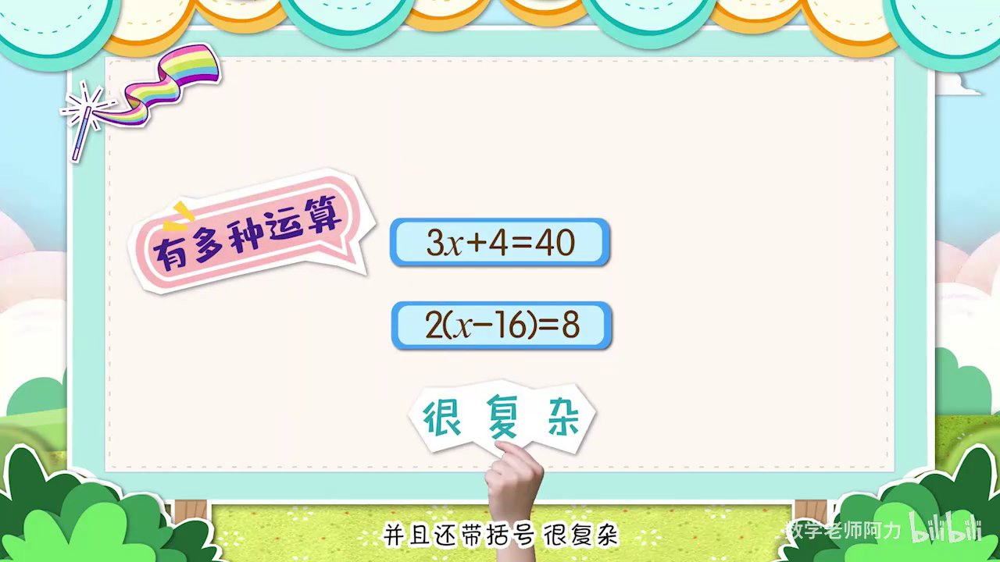
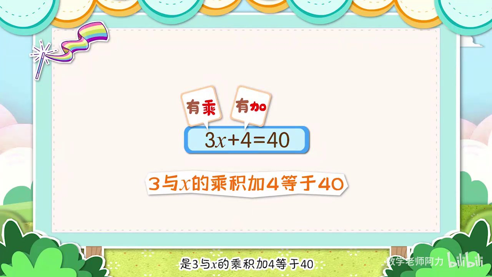
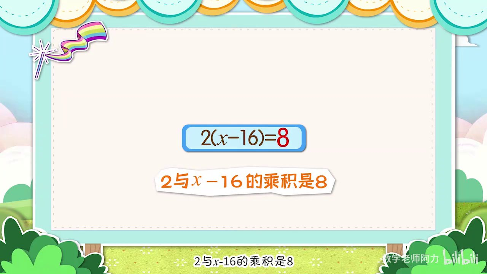
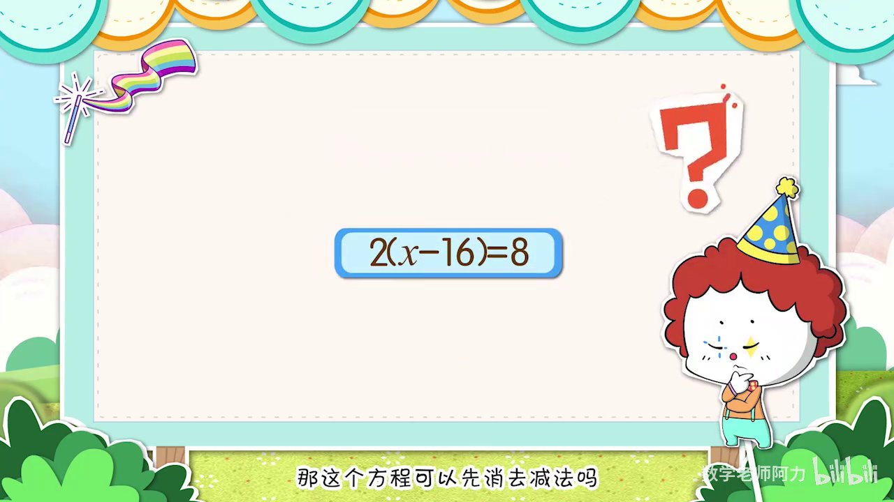
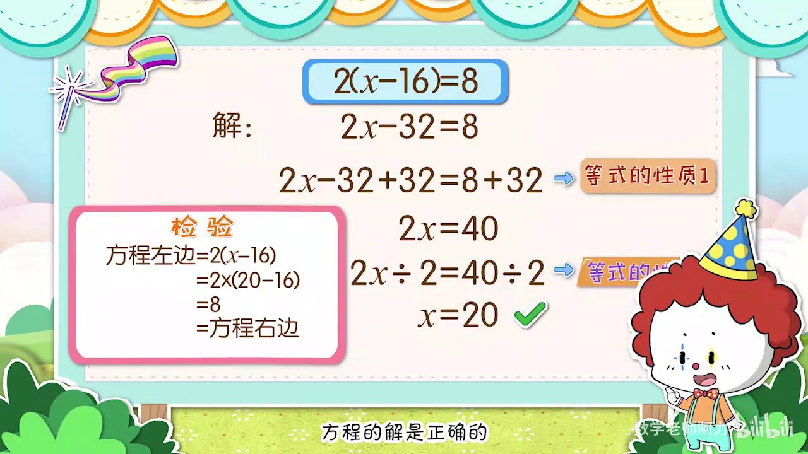
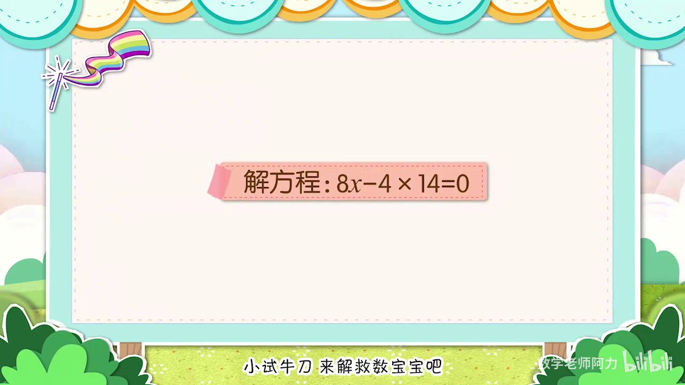

# 解含有多步运算与括号的复杂方程

**生成时间**: 2026-01-28 21:22:18

## 💡 核心摘要
本视频通过生动的故事情境，讲解了如何解决包含两种及以上运算（乘加、乘减）和括号的复杂方程。课程重点演示了两种核心策略：一是将带括号的代数式视为整体，运用等式性质逐步简化；二是运用乘法分配律去掉括号，将方程转化为熟悉的形式。同时强调了观察、分步求解和最后检验的重要性。

---

## 🎬 教学/剧情解析

### 1. 引入复杂方程与解题困境 `00:00:20`

- 面对一个包含乘法和加法的方程：3X + 4 = 40，以及一个包含乘法和减法的方程：2 * (X - 16) = 8。
- 指出这些方程比之前学习的只含单一运算的方程更复杂，因为混合了多种运算并带有括号。
- 初步尝试直接消去乘法（两边除以3）失败，因为导致除不尽，从而引出需要改变解题策略的思考。

### 2. 策略一：利用整体思想解乘加方程 `00:00:47`

- 针对方程 3X + 4 = 40，提出将'3X'视为一个整体的思路。
- 第一步：运用等式性质1（两边同时减4），将方程简化为 3X = 36，成功消去加法运算。
- 第二步：在新方程 3X = 36 的基础上，运用等式性质2（两边同时除以3），最终解得 X = 12。
- 完成解救后，强调了“先看成一个整体”再分步求解的策略有效性。

### 3. 应用整体思想解乘减方程 `00:01:47`

- 分析方程 2 * (X - 16) = 8，提出将括号内的'(X - 16)'整体看待。
- 第一步：运用等式性质2（两边同时除以2），将方程简化为 X - 16 = 4，求出这个整体的值。
- 第二步：在简化后的方程基础上，运用等式性质1（两边同时加16），解得 X = 20。
- 成功演示了如何通过整体思想，逐步剥离运算，求解未知数。

### 4. 策略二：运用乘法分配律改变方程形式 `00:02:22`

- 针对方程 2 * (X - 16) = 8，提出一种新的解法：先用乘法分配律去掉括号。
- 运用分配律将原方程转化为 2X - 32 = 8，使其形式与前面解过的'乘加'方程类似。
- 将'2X'视为整体，运用等式性质1（两边同时加32），简化为 2X = 40。
- 最后运用等式性质2（两边同时除以2），解得 X = 20，验证了不同解法可以得到相同正确结果。

### 5. 解题技巧总结与检验 `00:03:12`

- 解题后进行检验是必要步骤，将 X = 20 代入原方程验证其正确性。
- 总结核心思路：解复杂方程前，首先要仔细观察，判断哪部分可以看成整体。
- 灵活运用等式的性质是求解未知数的基础。
- 明确提出解决多步运算方程的完整流程：观察 -> 整体思想/分配律 -> 分步求解 -> 检验。

### 6. 综合练习与巩固 `00:03:39`

- 提供新的综合练习题：8X - 4 * 14 = 0，以巩固所学技巧。
- 演示解题前的观察步骤：识别出方程中存在乘法与减法运算。
- 优先计算常数项的乘法（4 * 14 = 56），将方程简化为 8X - 56 = 0，降低复杂度。
- 再次应用“整体思想”和等式性质，分步解得 X = 7，并代入检验，确认答案正确。

---

## 📚 知识小结

| 知识点 | 核心内容 | 学习/应用重点 | 难度系数 |
| :--- | :--- | :--- | :--- |
| **整体思想** | 在解方程时，将被括号括起来或与未知数紧密结合的代数式（如3X或X-16）暂时视为一个单一的数值或整体。 | 掌握识别方程中可以作为“整体”的部分，并运用等式性质先解出这个整体的值。 | ⭐⭐⭐ |
| **运算顺序的选择策略** | 在解混合运算方程时，运算的消去顺序会影响计算的简便性。应选择能使计算保持整数或更简单的步骤。 | 通过预先判断，选择先加减后乘除，或先乘除后加减的顺序，避免出现分数或复杂小数。 | ⭐⭐ |
| **乘法分配律的应用** | 利用 a * (b + c) = a*b + a*c 的定律，可以将含括号的方程转化为不含括号的形式，从而转换为更熟悉的方程类型。 | 学会在解方程时，灵活运用分配律展开括号，作为一种重要的方程变形策略。 | ⭐⭐ |
| **等式的性质** | 性质1：等式两边同时加上或减去同一个数，等式仍然成立。性质2：等式两边同时乘或除以同一个不为0的数，等式仍然成立。 | 熟练运用这两个基本性质，是所有方程求解步骤的理论基础和操作依据。 | ⭐ |
| **方程的检验** | 将解得的未知数的值代回到原方程中，计算等式两边是否相等，以验证解的正确性。 | 养成解完方程后进行检验的良好习惯，确保答案的准确性，是数学严谨性的体现。 | ⭐ |
